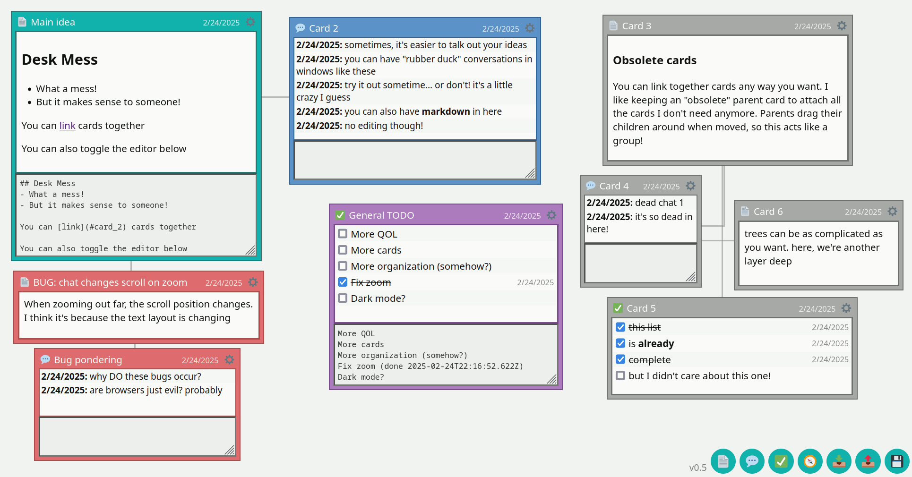

# Desk Mess

I got inspired by the non-linear, "save locally" [TiddlyWiki](https://tiddlywiki.com/)
and wanted to make something more akin to one of those pegboards filled
with images and string connecting them all. Or, a bunch of papers on a messy
desk. The person who organized it all knows where everything is, but
nobody else does.

## Features

- Create "cards" of various types anywhere you want visually
  - Text cards let you type markdown and render it
  - Chat cards let you dump thoughts as messages in a fake chatroom
  - Todo cards let you construct lists and check them off, saving the date of completion
- Set title, color, etc, resize, delete
- Ability to link cards together parent / child, build trees you can move around
- Fully local, save exact html and open it later where you left off,
  page will never update from underneath you (no server)
- Import/export raw data so you can upgrade to newer versions when desired
- Option to save/load from browser storage instead of filesystem (use `?local=name`, will use local storage + autosave)

## Goals

- If mobile support is added, perhaps different navigation modes
- Different types of things you can put in cards (drawing, etc)
- List all cards in simplified list tree view somewhere
- Add files to cards. Do we save it directly into the card though?
  blobs make everything very large in b64.
- Display all cards of a "type" and a simplified view of how you get to them.
  For things like finding all todo lists
- Grid snapping for slightly less disorganization?

## How to use

Since this is a local-first app, all you need is index.html. You can download it directly from the
repo or alternatively get it from the source zip from one of the releases.

**To use with the filesystem:**
- Copy index.html to someplace on your filesystem, rename it whatever you want
- Open it in your browser
- As you make changes, you can save with the 💾 icon. This will create a pure copy of the current webpage and download it. It will be exactly where you left off, but a _new_ file (because of browser security limitations)
- These saved files will always work and will never change; the version will stay the same, so I can't change the system out from underneath you. The .html file is fully self-contained.
- You can use the import 📥 and export 📤 features if you wish to update the "app" to the latest version. Instead of saving a fully functioning webpage, you only save the data, letting you open a fresh copy of index.html and import.

This is how tiddlywiki and other apps like this work. You get to manage your own files and data and you can be sure they always work. However, if the above sounds like too much work, you can more easily store changes in the browser itself.

**To use with browser saving:**
- Save ONE copy of index.html somewhere on your computer. Use this copy every time, or host it yourself on your server
- Add `?local=somename`, replace "somename" with the name you want to give your file
- Once confirming the alert, saves are done in the browser automatically every minute. Saves are stored in local storage, make sure you have that enabled (some browsers clear all local storage on every exit). You can still manually save any time; manual save is replaced with in-browser save (it no longer downloads a pure copy of the page)
- Bookmark this page. It should always have your page
- You can still manually export to your filesystem whenever, and import the data later.
