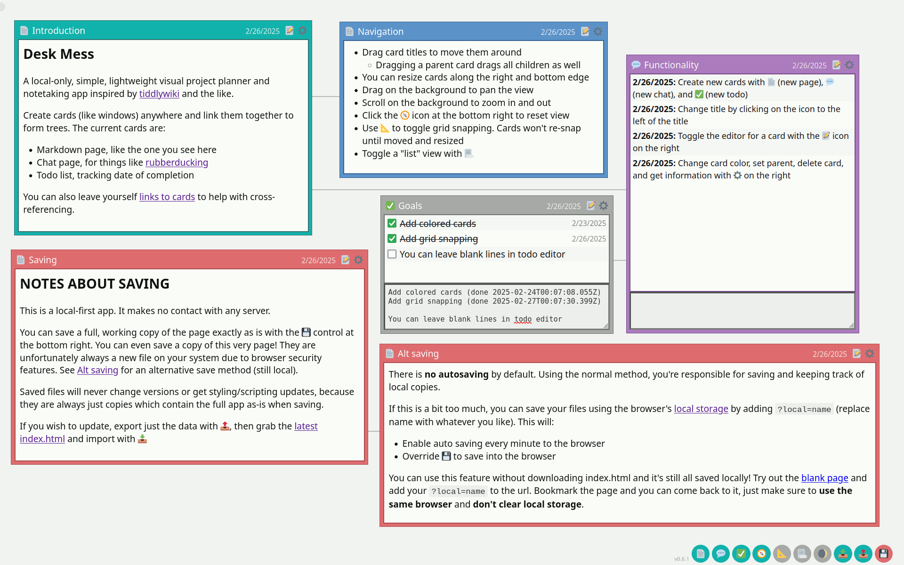

# Desk Mess

I got inspired by the non-linear, "save locally" [TiddlyWiki](https://tiddlywiki.com/)
and wanted to make something more akin to one of those pegboards filled
with images and string connecting them all. Or, a bunch of papers on a messy
desk. The person who organized it all knows where everything is, but
nobody else does.

It's as easy as downloading index.html, or you can try it out [here](https://haloopdy.com/deskmess).

## Features

- Create "cards" of various types anywhere you want visually
  - Text cards let you type markdown and render it
  - Chat cards let you dump thoughts as messages in a fake chatroom
  - Todo cards let you construct lists and check them off, saving the date of completion
  - Image cards let you embed images directly into the page. Most browsers limit to 2mb FYI
  - Drawing cards let you draw simple vector shapes
- Set title, color, etc, resize, delete
- Dark mode
- Toggle modern styling 🤔
- Grid snapping
- Ability to link cards together as parent / child, build trees you can move around
- Sidebar with tree navigation for entire project
- Fully local single file, save exact html and open it later where you left off,
  page will never update from underneath you (no server unless desired)
- Import/export raw data so you can upgrade to newer versions when desired
- Option to save/load from browser storage instead of filesystem (use `?local=name`, will use local storage + autosave)
- Option to save/load from a local server (use `?server=url`, will GET for load and POST for save + autosave)
  - Included in the repo is a basic implementation suitable for local network use, [server.py](server.py)

## Goals

- If mobile support is added, perhaps different navigation modes
- Add regular files to cards, if possible
- Display all cards of a "type" and a simplified view of how you get to them.
  For things like finding all todo lists

## How to use

Since this is a local-first app, all you need is index.html. You can download it directly from the
repo or alternatively get it from the source zip from one of the releases.

For usage tips, see the [example page](https://haloopdy.com/deskmess). Or to start
from a blank slate, try the [latest release](https://haloopdy.com/deskmess/deskmess.html)

### Use the filesystem (default)
- Copy index.html to someplace on your filesystem, rename it whatever you want
- Open it in your browser
- As you make changes, you can save with the 💾 icon. This will create a pure copy of the current webpage and download it. It will be exactly where you left off, but a _new_ file (because of browser security limitations)
- These saved files will always work and will never change; the version will stay the same, so I can't change the system out from underneath you. The .html file is fully self-contained.
- You can use the import 📥 and export 📤 features if you wish to update the "app" to the latest version. Instead of saving a fully functioning webpage, you only save the data, letting you open a fresh copy of index.html and import.

This is how tiddlywiki and other apps like this work. You get to manage your own files and data and you can be sure they always work. However, if the above sounds like too much work, you can more easily store changes in the browser itself.

### Use browser local storage
This will store your data within the browser's [local storage](https://developer.mozilla.org/en-US/docs/Web/API/IndexedDB_API)
rather than the filesystem. Since the browser counts this as a "secure context", it lets you treat saves more normally,
with the ability to overwrite and thus have auto-saves. Be warned: if you clear your browser's site data, you will
**lose all of your saves**.
- Save ONE copy of index.html somewhere on your computer. Use this copy every time, or host it yourself on your server
- Add `?local=somename` to the url, replace "somename" with the name you want to give your notes
- Once confirming the alert, saves are done in the browser automatically every minute. Saves are stored in local storage, make sure you have that enabled (some browsers clear all local storage on every exit). You can still manually save any time; manual save is replaced with in-browser save (it no longer downloads a pure copy of the page)
- Bookmark this page. It should always have your page
- You can still manually export to your filesystem whenever, and import the data later.

### Use a basic server
If you don't trust the browser's local storage or simply want the ease of auto-saving and more normal saving
mechanics while still using the filesystem, you can have deskmess contact a server for loads and stores.
An example implementation is given with [server.py](server.py). It's fine for local use, but don't use it on a public facing server.
- Run server with `python3 server.py`. It should work on any system where python is installed. For windows,
  this may be `py server.py`
- Open http://localhost:60003 in your browser
- Add `?server=somename` to the url, replace "somename" with the name to give your notes
- Bookmark this page. Assuming your server is running, this page should always be available
- As with browser saving, you can still manually export just the data to the filesystem for later import, though
  that's not as necessary since `server.py` stores the same saves in the local `notes` folder
- The `server` parameter is actually a full url. You can pass it a different server than the current
  by passing the full url, such as `?server=http://localhost:60003/somename`

Deskmess expects a *very* simple server when using the `?server` parameter. It expects GET requests to the url
given to return the plaintext UTF-8 data for the save, and POST requests to save the plaintext UTF-8 data
for the same save. No assumption of data format is made; use `text/plain` (even though the format is currently
json). The supplied `server.py` accepts any single-depth route as the filename for the filesystem, allowing
the server to store any number of saves. It is very picky about the filename given, only accepting alphanumeric
characters, underscores, and dashes (to prevent accident or abuse). There's no security; this is fine for local
use but don't use this on a public server. To simplify things, GET at the root path returns index.html,
though this isn't necessary for your implementation.

